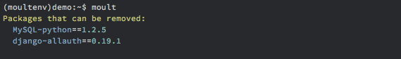
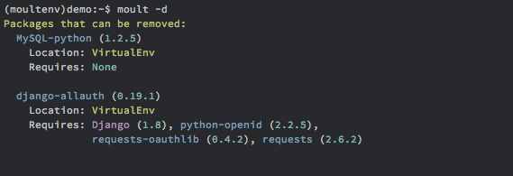
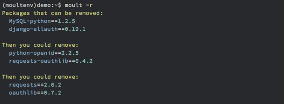
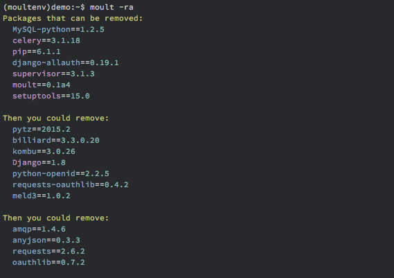
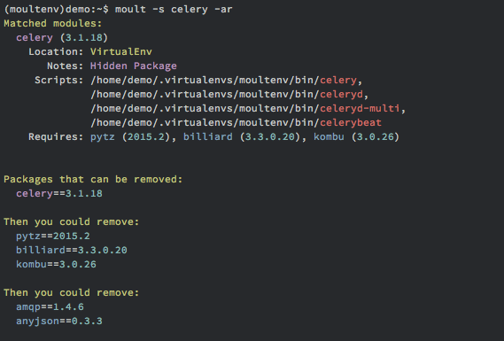
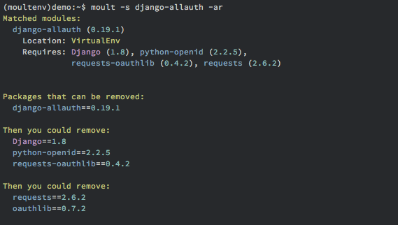
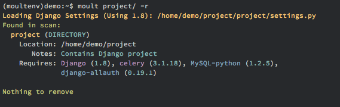

************
Crash Course
************

Installation
------------

Start by installing moult via ``pip install moult``

**Note**: You *must* already have :command:`pip` installed. It is not
installed as a requirement for :command:`moult` since :command:`pip` may
attempt to upgrade itself in the process.

Displaying packages that can be removed
---------------------------------------

To display packages that can be removed, run ``moult`` with no options.

Moult reports that the packages :file:`MySQL-python` and
:file:`django-allauth`.

You can display more detailed information about the packages by using the ``-d`` flag.

As you can see, it appears that removing :file:`MySQL-python` will leave
nothing behind. But, :file:`django-allauth` would leave a few packages
behind if you removed it.

To display just how far you can go with removals, you can use the ``-r`` flag.

What you see here is all of the packages that can be removed. You may have
noticed that :file:`Django` was not displayed as a package that could be
removed. This is because it's a :ref:`hidden package<show-all>`. To
display hidden packages, add the ``-a`` flag.

Suddenly there's a lot more packages being suggested. Packages like :file:`celery`
and :file:`supervisor` are hidden because they appear to be standalone packages
(they have shell scripts).  Suppose you want to keep :file:`supervisor`, but want
to remove :file:`celery`, you could run: ``moult -s celery -ar``

:command:`moult` displays all the packages that can be removed if you were to
remove :file:`celery`.  If you're anything like me, you would remove :file:`celery`
and later run ``pip freeze``, see the left over packages, and start Googling
them to see what installed them.  No more of that!

Here's one more example where removing a package would normally leave you
scratching your head late at night:

There might've been times when you saw something like :file:`oauthlib`
and decided to leave it around because it *sounded important* to
*some package*.  Now you know for sure that it can go.

Scanning your projects
----------------------

Seeing what packages can be removed is great and all, but what about **your**
project's package requirements?

:command:`moult` can be supplied with a directory or file to scan for imports.
Below is a scan of a simple Django project.

Contrary to what the first command in this crash course showed,
:file:`MySQL-python` and :file:`django-allauth` are actually needed by
this Django project.  :command:`moult` also noticed that this
directory contained a Django project and loaded its settings to
determine what packages the project was configured to use.
